# Automated Release Pipeline for `go-rabbitmq`

[Home](../README.md) &nbsp;/&nbsp; Automated Release Pipeline

&nbsp;

This directory contains the GitHub Actions workflows and configuration for the automated dependency update and release pipeline.

&nbsp;

## Monitoring Dependencies

The pipeline **automatically discovers and monitors ALL dependencies** from your `go.mod` file:

&nbsp;

### Auto-Discovery Process

1. **Scans go.mod** - Extracts all direct dependencies automatically
2. **Checks for Updates** - Uses `go list -m -u` to find available updates
3. **Smart Filtering** - Excludes standard library and local modules
4. **Dynamic Updates** - Adapts to dependency changes without configuration

&nbsp;

### Customization

#### Update Dependencies List (automatic)

**No manual configuration needed!** The pipeline automatically:

- Discovers all dependencies from `go.mod`
- Adapts when you add/remove dependencies
- Handles version constraint changes
- Scales with your project growth

&nbsp;

To add a new dependency:

```bash
# Just add the dependency normally
go get github.com/new/awesome-package

# Commit the changes
git add go.mod go.sum
git commit -m "feat: add awesome-package dependency"

# The automation will automatically include it in future checks!
```

🔝 [back to top](#automated-release-pipeline-for-go-rabbitmq)

&nbsp;

To exclude specific dependencies (if needed), edit `.github/auto-release-config.yaml`:

```yaml
dependencies:
  exclude_patterns:
    - "*.local/*"  # Skip local/private modules
    - "example.com/legacy/*"  # Skip specific patterns
```

🔝 [back to top](#automated-release-pipeline-for-go-rabbitmq)

&nbsp;

### Current Dependencies (Auto-Detected)

| Package | Version | Status |
|---------|---------|--------|
| `github.com/cloudresty/emit` | v1.2.5 | Auto-monitored |
| `github.com/cloudresty/ulid` | v1.2.1 | Auto-monitored |
| `github.com/cloudresty/go-env` | v1.0.1 | Auto-monitored |
| `github.com/rabbitmq/amqp091-go` | v1.10.0 | Auto-monitored |
| `google.golang.org/protobuf` | v1.36.6 | Auto-monitored |

🔝 [back to top](#automated-release-pipeline-for-go-rabbitmq)

&nbsp;

### Dynamic Features

- **Add New Dependencies** - Just run `go get new/package` and commit to `go.mod`
- **Remove Dependencies** - Remove from `go.mod` and the automation adapts
- **Version Constraints** - Respects any version constraints in `go.mod`
- **Smart Updates** - Updates direct dependencies and their compatible indirect dependencies

🔝 [back to top](#automated-release-pipeline-for-go-rabbitmq)

&nbsp;

## Files Overview

### Workflow Files (`.github/workflows/`)

- **`auto-dependency-update.yaml`** - Weekly dependency monitoring and updates
- **`auto-merge-to-main.yaml`** - Automatic merging from develop to main
- **`auto-release.yaml`** - Automatic versioning and GitHub releases

&nbsp;

### Configuration Files

- **`auto-release-config.yaml`** - Configuration for the automation pipeline
- **`setup-auto-release.sh`** - Setup script for configuring secrets and permissions

🔝 [back to top](#automated-release-pipeline-for-go-rabbitmq)

&nbsp;

## Automation Flow

```mermaid
graph TD
    A[Weekly Schedule<br/>Monday 2 AM UTC] --> B[Check Dependencies]
    B --> C{Updates Found?}
    C -->|Yes| D[Create PR to develop]
    C -->|No| E[Skip]
    D --> F[Run Tests]
    F --> G{Tests Pass?}
    G -->|Yes| H[Auto-merge PR]
    G -->|No| I[Block merge]
    H --> J[develop updated]
    J --> K[Test develop branch]
    K --> L{All Tests Pass?}
    L -->|Yes| M[Merge develop → main]
    L -->|No| N[Block merge]
    M --> O[Auto-release]
    O --> P[Notifications]
```



🔝 [back to top](#automated-release-pipeline-for-go-rabbitmq)

&nbsp;

## Monitored Dependencies

Based on the current `go.mod`, the pipeline monitors:

| Package | Current Version | Update Frequency |
|---------|----------------|------------------|
| `github.com/cloudresty/emit` | v1.2.5 | Weekly |
| `github.com/cloudresty/ulid` | v1.2.1 | Weekly |
| `github.com/cloudresty/go-env` | v1.0.1 | Weekly |
| `github.com/rabbitmq/amqp091-go` | v1.10.0 | Weekly |
| `google.golang.org/protobuf` | v1.36.6 | Weekly |

🔝 [back to top](#automated-release-pipeline-for-go-rabbitmq)

&nbsp;

## Setup Instructions

### 1. Run the Setup Script

```bash
chmod +x .github/setup-auto-release.sh
./.github/setup-auto-release.sh
```

&nbsp;

### 2. Required GitHub Secrets

The automation requires these secrets to be set in your GitHub repository:

&nbsp;

#### Required

- **`GITHUB_TOKEN`** - Automatically provided by GitHub Actions
- **`CLOUDRESTY_GITBOT_PAT`** - Cloudresty GitBot Personal Access Token with `repo` and `workflow` permissions

&nbsp;

#### Optional

*Note: Notifications are handled through GitHub App integration. No additional webhook configuration needed.*

&nbsp;

### 3. Branch Protection (Recommended)

Set up branch protection rules for:

- **`main`** branch:
  - Require pull request reviews
  - Require status checks to pass
  - Restrict pushes to admins only

- **`develop`** branch:
  - Require pull request reviews
  - Require status checks to pass

🔝 [back to top](#automated-release-pipeline-for-go-rabbitmq)

&nbsp;

## Test Suite

The automation runs comprehensive tests:

&nbsp;

### Unit Tests

- All package tests with race detection
- Short test mode for quick feedback

&nbsp;

### Integration Tests

- RabbitMQ streams functionality
- Real RabbitMQ instance with streams plugin
- Message ID preservation verification

&nbsp;

### Quality Checks

- golangci-lint static analysis
- Go module verification
- Code formatting checks

🔝 [back to top](#automated-release-pipeline-for-go-rabbitmq)

&nbsp;

## Versioning Strategy

The automation determines version bumps from commit messages:

| Commit Keywords | Version Bump | Example |
|----------------|--------------|---------|
| `BREAKING`, `breaking change`, `major` | Major (1.0.0 → 2.0.0) | Breaking API changes |
| `feat`, `feature`, `add`, `minor` | Minor (1.0.0 → 1.1.0) | New features |
| `fix`, `bug`, `patch`, `chore`, `deps` | Patch (1.0.0 → 1.0.1) | Bug fixes, maintenance |

🔝 [back to top](#automated-release-pipeline-for-go-rabbitmq)

&nbsp;

## Manual Operations

### Trigger Dependency Check

```bash
# Via GitHub CLI
gh workflow run auto-dependency-update.yaml

# Via GitHub UI
# Go to Actions → Auto Dependency Update → Run workflow
```

&nbsp;

### Trigger Manual Release

```bash
# Via GitHub CLI
gh workflow run auto-release.yaml -f release_type=patch

# Available options: patch, minor, major
```

&nbsp;

### Override Auto-merge

If you need to temporarily disable auto-merging:

1. Add `[skip-auto-merge]` to your commit message
2. Or close the auto-generated PR and create a manual one

🔝 [back to top](#automated-release-pipeline-for-go-rabbitmq)

&nbsp;

## Further Customization

### Update Dependencies List

Edit `.github/auto-release-config.yaml`:

```yaml
dependencies:
  modules:
    - name: "your/new-dependency"
      type: "external"
      check_frequency: "weekly"
```

🔝 [back to top](#automated-release-pipeline-for-go-rabbitmq)

&nbsp;

### Change Schedule

Edit `.github/workflows/auto-dependency-update.yaml`:

```yaml
schedule:
  # Change from weekly to daily
  - cron: '0 2 * * *'  # Daily at 2 AM UTC
```

🔝 [back to top](#automated-release-pipeline-for-go-rabbitmq)

&nbsp;

## Monitoring

### Check Workflow Status

```bash
# List recent workflow runs
gh run list

# View specific run details
gh run view <run-id>

# View logs
gh run view <run-id> --log
```

🔝 [back to top](#automated-release-pipeline-for-go-rabbitmq)

&nbsp;

### Dependency Update History

- All dependency updates are tracked in the git history
- PR descriptions contain detailed change information
- Release notes include dependency change summaries

🔝 [back to top](#automated-release-pipeline-for-go-rabbitmq)

&nbsp;

## Troubleshooting

### Common Issues

1. **GitBot PAT Token Permissions**
   - Ensure the CLOUDRESTY_GITBOT_PAT token has `repo` and `workflow` scopes
   - Token must not be expired

2. **Branch Protection Conflicts**
   - Auto-merge requires appropriate permissions
   - Check branch protection rules aren't too restrictive

3. **Test Failures**
   - Integration tests require Docker
   - RabbitMQ must start successfully with streams plugin

4. **Dependency Resolution**
   - Ensure all dependencies in go.mod are accessible
   - Private repositories need appropriate access tokens

🔝 [back to top](#automated-release-pipeline-for-go-rabbitmq)

&nbsp;

### Debug Mode

Add this to workflow files for debug logging:

```yaml
env:
  ACTIONS_STEP_DEBUG: true
  ACTIONS_RUNNER_DEBUG: true
```

🔝 [back to top](#automated-release-pipeline-for-go-rabbitmq)

&nbsp;

## Additional Resources

- [GitHub Actions Documentation](https://docs.github.com/en/actions)
- [Semantic Versioning](https://semver.org/)
- [Go Modules Documentation](https://golang.org/ref/mod)
- [RabbitMQ Streams Guide](https://www.rabbitmq.com/streams.html)

🔝 [back to top](#automated-release-pipeline-for-go-rabbitmq)

&nbsp;

---

&nbsp;

### Cloudresty

[Website](https://cloudresty.com) &nbsp;|&nbsp; [LinkedIn](https://www.linkedin.com/company/cloudresty) &nbsp;|&nbsp; [BlueSky](https://bsky.app/profile/cloudresty.com) &nbsp;|&nbsp; [GitHub](https://github.com/cloudresty)

&nbsp;
